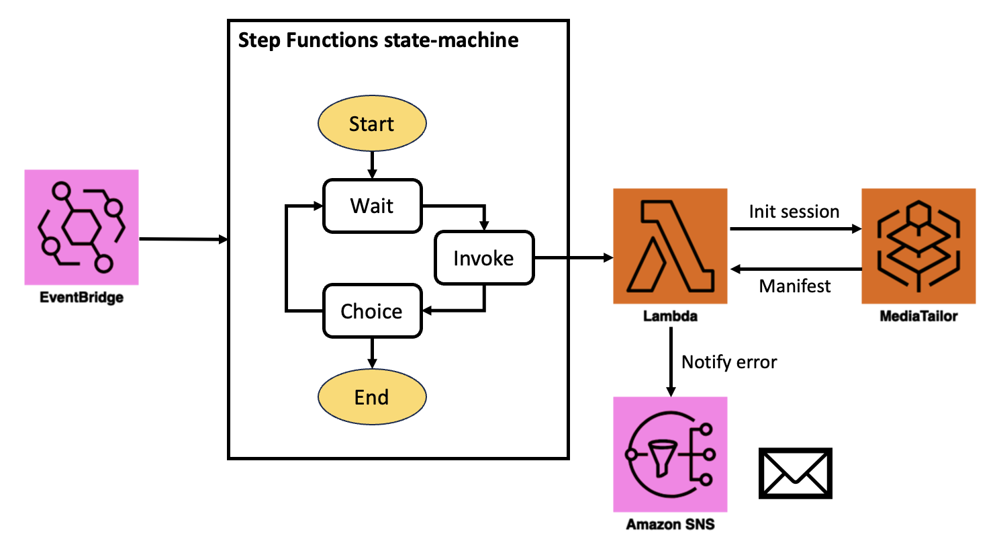

# awscdk-construct-fetch-job
[](https://constructs.dev/packages/awscdk-construct-fetch-job)

CDK Construct for scheduling a cron job that periodically accesses a MediaTialor endpoint
* Input:
  * MediaTailor session initialization URL
  * Cron schedule expression
  * Fetch interval (seconds)
  * Fetch count per cron job
  * Email address for nortifying errors
* Output:
  * Lambda function for fetching MediaTailor HLS/DASH endpoint
  * StepFunctions state-machine for invoking the Lambda function with a specified interval/count
  * EventBridge rule for periodically running the state-machine
  * SNS Topic for notifiying any errors

  

## Install
[](https://nodei.co/npm/awscdk-construct-fetch-job/)

## Usage
Below is an example of deploying a cron job that runs at 11:59 every Saturday. Once the job gets started, it fetches the manifest every 2 seconds until it's repeated 30 times.
```ts
import { Stack, StackProps, CfnOutput } from 'aws-cdk-lib';
import { Construct } from 'constructs';
import { FetchJob } from 'awscdk-construct-fetch-job';

export class ExampleStack extends Stack {
  constructor(scope: Construct, id: string, props?: StackProps) {
    super(scope, id, props);

    const job = new FetchJob(this, 'FetchSchedule', {
      emailAddr: 'Your email address',
      sessionInitializationUrl: 'MediaTailor session initialization URL',
      startTime: { hour: '11', minute: '59', weekDay: 'SAT' }, // Cron pattern
      intervalInSeconds: 2, // Fetch interval
      fetchCount: 30, // Fetch count per cron job
    });

    // Print the ARN of the EventBridge rule
    new CfnOutput(this, "EventBridgeRuleARN", {
      value: job.rule.ruleArn,
      exportName: "EventBridgeRuleARN",
      description: "ARN of EventBridge Rule - fetch",
    });
  }
}
```
